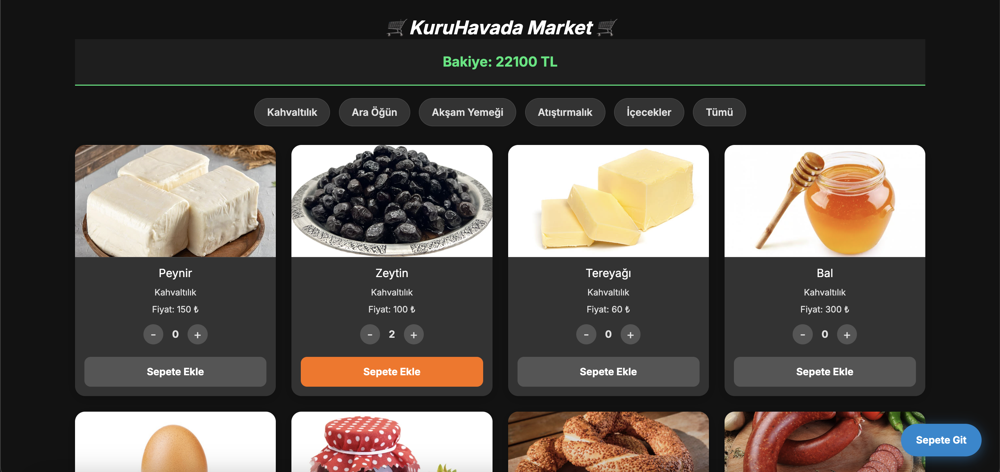

## Ekran Görüntüleri
### Ana Sayfa


## Canlı Demo
Projenin canlı demosuna [buradan](https://online-shopping-six-lime.vercel.app) ulaşabilirsiniz.

# Online Alışveriş Uygulaması

Bu proje, çevrimiçi alışveriş deneyimini kolaylaştırmak için geliştirilmiş bir uygulamadır.

## Özellikler
- Ürün arama ve filtreleme
- Sepete ürün ekleme
- Güvenli ödeme sistemi
- Sipariş takibi

## Kurulum
1. Bu projeyi klonlayın:
    ```bash
    git clone https://github.com/kullaniciadi/OnlineShopping.git
    ```
2. Gerekli bağımlılıkları yükleyin:
    ```bash
    npm install
    ```
3. Uygulamayı başlatın:
    ```bash
    npm start
    ```

## Katkıda Bulunma
Katkıda bulunmak için lütfen bir pull request gönderin.

## Lisans
Bu proje MIT Lisansı ile lisanslanmıştır.